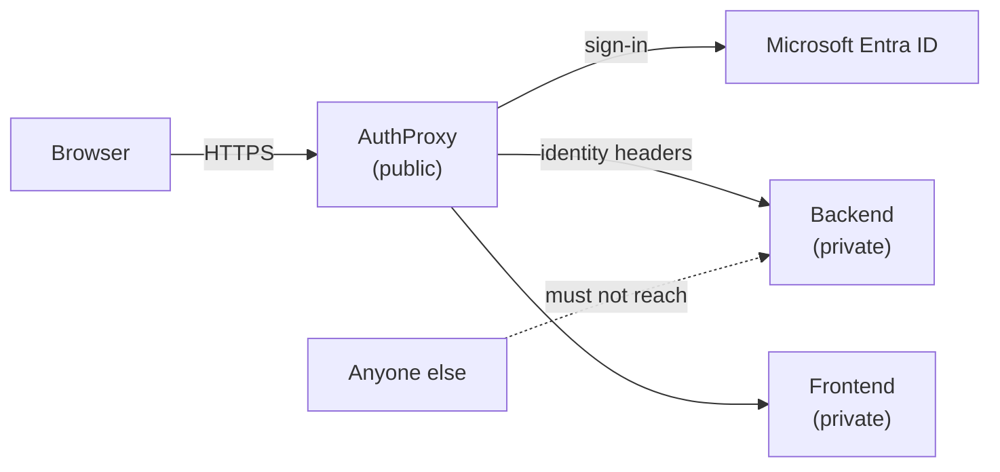

# Deploying on Azure

This guide takes AuthProxy from nothing to a working deployment on Azure, signing users in with Microsoft
Entra ID, and keeping your backends reachable **only** through the proxy. The platform-specific steps are in
[App Service](app-service.md) and [Container Apps](container-apps.md); everything that is the same on both is
here.



---

## Backends trust AuthProxy, so only AuthProxy may reach them

This is the one decision in the whole deployment that cannot be fixed afterwards.

AuthProxy strips the identity headers a caller sends, authenticates the caller, and writes
`x-ms-client-principal`, `x-ms-client-principal-id` and `x-ms-client-principal-name` itself. Your backend
believes them. They are **not signed**: a backend cannot tell a request that went through AuthProxy from one
that did not, except by the network it arrived on. See
[Forwarded identity headers](../configuration/authentication.md#forwarded-identity-headers).

So a backend that anyone other than AuthProxy can open a connection to is a backend anyone can impersonate any
user on, by sending the header. The platform features that prevent this differ, and getting them wrong is
easy because the failure is silent: the application works perfectly, for everybody, including the person
forging the header. Each platform page ends with an isolation recipe. The [direct-access
test](#test-that-a-backend-cannot-be-reached-directly) below checks the routes you probe; it does not prove
that no other route to the backend exists.

---

## Register the application in Microsoft Entra ID

1. In the Microsoft Entra admin center, **App registrations** > **New registration**. Choose **Accounts in
   this organizational directory only** (single tenant) unless you really do accept other organizations.
2. Under **Authentication**, add a **Web** platform with two redirect URIs, using the public host name users
   type (`auth.example.com` below):

   | Redirect URI | Why |
   |--------------|-----|
   | `https://auth.example.com/signin-microsoft` | The sign-in callback. The last segment is `signin-` plus the provider `Name` lowercased with spaces replaced by hyphens, so a provider named `Microsoft` gives `signin-microsoft`. |
   | `https://auth.example.com/.cratis/logout/callback` | The post-logout callback. Microsoft requires `post_logout_redirect_uri` to match a registered redirect URI. See [Logout](../configuration/logout.md#full-chain-logout). |

   Entra accepts `http` only for `localhost`, so register the public `https` address, not the platform's
   internal one.
3. Under **Certificates & secrets**, create a **client secret**. See [the credential](#the-credential)
   below before you pick a lifetime.
4. Copy the **Application (client) ID** and the **Directory (tenant) ID**.

### The credential

Microsoft recommends certificate or federated (managed identity) credentials for confidential clients, and
advises against secrets in production. AuthProxy's OIDC provider takes **a client secret only**
(`ClientSecret`); certificate and federated credentials are not supported yet and are tracked in
[Cratis/AuthProxy#149](https://github.com/Cratis/AuthProxy/issues/149). Until then:

- Keep the secret out of source control and out of plain app settings. Hold it in Key Vault and reference it
  from the platform (the platform pages show how).
- Choose a short lifetime and put the expiry in a calendar or an alert. When it expires, **every sign-in
  fails** until the setting is replaced.
- Rotate with overlap: Entra lets two secrets be valid at once, so add the new one, update the setting,
  restart, then delete the old one.

### Who may sign in

A single-tenant authority already refuses accounts from other directories, but every account in **your**
directory can sign in. Narrow it in this order, using as many as you need:

- On the **enterprise application**, turn on **Assignment required**. Only users you assign can then sign in.
  Grant tenant-wide admin consent to the application first, because user consent is not allowed once
  assignment is required. Assigning groups rather than individual users needs Microsoft Entra ID P1 or P2.
- Define **app roles** on the app registration, assign them to users or groups, and require one in AuthProxy
  with [`Authorization`](../configuration/authorization.md). Entra puts assigned roles in the `roles` claim of
  the ID token.
- Do both for anything sensitive. Assignment keeps strangers out; the AuthProxy requirement keeps a
  mistakenly-assigned or newly-added user without the role out of services that need more.

### The AuthProxy provider

```json
{
  "Cratis": {
    "AuthProxy": {
      "Authentication": {
        "OidcProviders": [
          {
            "Name": "Microsoft",
            "Type": "Microsoft",
            "Authority": "https://login.microsoftonline.com/<directory-tenant-id>/v2.0",
            "ClientId": "<application-client-id>",
            "ClientSecret": "<from the secret store>",
            "CanonicalIdentity": {
              "ProviderKey": "entra-workforce",
              "SubjectClaimType": "oid"
            }
          }
        ]
      },
      "Authorization": {
        "RequiredClaims": [
          { "Claim": "roles", "AnyOf": [ "AuthProxy.User" ] }
        ]
      }
    }
  }
}
```

- **Use the tenant-specific authority** shown, not `common` or `organizations`. A multi-tenant authority
  accepts any Entra directory.
- **`CanonicalIdentity` with `SubjectClaimType: oid`** makes the stable object ID the user's subject, instead
  of a value Entra can change or reassign. See
  [Canonical federated identity](../configuration/authentication.md#canonical-federated-identity).
  It also keeps Entra's claim names as they are in the token, which is why the requirement above says
  `roles`. **Without** `CanonicalIdentity` the .NET handler renames that claim, and the requirement would
  have to name `http://schemas.microsoft.com/ws/2008/06/identity/claims/role` instead.
- Drop the `Authorization` section if you rely on **Assignment required** alone.
- Changing `CanonicalIdentity` later signs every existing user out, so decide before go-live.

On both platforms these are set as environment variables; `__` replaces `:` and array positions are
indexes:

```bash
Cratis__AuthProxy__Authentication__OidcProviders__0__Name=Microsoft
Cratis__AuthProxy__Authentication__OidcProviders__0__Type=Microsoft
Cratis__AuthProxy__Authentication__OidcProviders__0__Authority=https://login.microsoftonline.com/<directory-tenant-id>/v2.0
Cratis__AuthProxy__Authentication__OidcProviders__0__ClientId=<application-client-id>
Cratis__AuthProxy__Authentication__OidcProviders__0__ClientSecret=<from the secret store>
Cratis__AuthProxy__Authentication__OidcProviders__0__CanonicalIdentity__ProviderKey=entra-workforce
Cratis__AuthProxy__Authentication__OidcProviders__0__CanonicalIdentity__SubjectClaimType=oid
Cratis__AuthProxy__Authorization__RequiredClaims__0__Claim=roles
Cratis__AuthProxy__Authorization__RequiredClaims__0__AnyOf__0=AuthProxy.User
```

---

## Point AuthProxy at your services

Name each backend and frontend by the address AuthProxy reaches it on from inside your network, following
the isolation recipe for [App Service](app-service.md#isolating-backends) or
[Container Apps](container-apps.md#isolating-backends). On App Service this can be the normal
`*.azurewebsites.net` name, resolved privately or protected by service-endpoint access restrictions:

```bash
Cratis__AuthProxy__Services__portal__Backend__BaseUrl=https://<backend-address-reachable-by-authproxy>/
Cratis__AuthProxy__Services__portal__Frontend__BaseUrl=https://<frontend-address-reachable-by-authproxy>/
```

With one service, `/api/**` goes to the backend and everything else to the frontend. With several, a
caller names the service on each request. See [Services](../configuration/services.md).

---

## Settings every Azure deployment needs

### Trusted proxies

The platform terminates TLS and forwards the request over plain HTTP, so AuthProxy only knows the request was
HTTPS, and who the client is, from `X-Forwarded-Proto` and `X-Forwarded-For`. If those are not believed,
**session cookies are issued without `Secure`** and sign-in notifications record the platform's address as the
client. Tell AuthProxy which peers to believe:

```bash
Cratis__AuthProxy__Ingress__Mode=Configured
Cratis__AuthProxy__Ingress__TrustedProxies__0=...
Cratis__AuthProxy__Ingress__ForwardLimit=1
```

The values differ per platform and are given on each platform's page. Add one to `ForwardLimit`, and trust
the extra hop, for every proxy you put in front of the platform's own ingress, such as Azure Front Door or
Application Gateway. See [Trusted proxies](../configuration/trusted-proxies.md). Do **not** set
`ASPNETCORE_FORWARDEDHEADERS_ENABLED`.

### Data Protection keys

AuthProxy encrypts its session cookie and tokens with Data Protection keys. Local disk is not shared between
replicas and is not kept across restarts on either platform, so **a deployment with more than one replica
will sign users out at random** until the keys are shared. Use Azure Blob Storage, encrypted with a Key Vault
key, with a managed identity:

```bash
Cratis__AuthProxy__DataProtection__Store=AzureBlob
Cratis__AuthProxy__DataProtection__AzureBlob__BlobUri=https://<account>.blob.core.windows.net/dataprotection/authproxy-keys.xml
Cratis__AuthProxy__DataProtection__KeyVault__KeyIdentifier=https://<vault>.vault.azure.net/keys/authproxy-dataprotection
```

Give AuthProxy's managed identity the `Storage Blob Data Contributor` role on the container and the
`Key Vault Crypto User` role on the key, and create the container and an RSA key first. If the identity is
user-assigned, also set `Cratis__AuthProxy__DataProtection__ManagedIdentityClientId`. Every detail, and the
Redis alternative, is in [Data protection keys](../configuration/data-protection.md).

### Timeouts and streaming

Frontends that stream (WebSockets, Server-Sent Events) are cut when they go quiet for longer than the
shortest idle limit on the path: AuthProxy's `ActivityTimeout` (five minutes by default) or the platform
ingress's own. Send a heartbeat comfortably inside the shortest of them, and raise AuthProxy's only if the
platform's is longer. The platform limits are on the platform pages;
[Timeouts and streaming](../configuration/services.md#timeouts-and-streaming) covers AuthProxy's side.

### Health probes

AuthProxy answers nothing about itself on the public port, and an HTTP probe pointed at `/` gets `401`. Use the
[management listener](../configuration/management-listener.md) where the platform can probe a second port, and
a declared [anonymous path](../configuration/services.md#anonymous-paths) where it cannot. The platform pages
say which applies.

### Do not turn on the platform's own sign-in

App Service **Authentication** and Container Apps **Authentication** put a second sign-in in front of
AuthProxy. AuthProxy does the sign-in; leave the platform feature off for the AuthProxy app.

---

## Test that a backend cannot be reached directly

Put this check in your pipeline to detect unexpected responses on the routes you probe. It sends a request
that **claims to be a signed-in user** straight to the backend's own address. It fails on every HTTP response
unless you explicitly identify an expected platform refusal, and on indeterminate transport failures.

Choose an endpoint that returns `2xx` for **any authenticated principal**, including the exact `forged`
fixture below. Arc's `/.cratis/me` qualifies with its default identity-details provider, or a custom provider
that accepts any user. A custom provider that denies the forged user returns an application `403`; an app
without that endpoint returns `404`. Neither proves isolation. Before using the probe, send the same three
headers and principal below from an allowed location inside the trust boundary and confirm that the chosen
endpoint returns `2xx`. Also check the endpoint through AuthProxy with a signed-in user.

Save this as `assert-backend-isolated.sh` (requires Bash, curl, base64 and grep):

```bash
#!/usr/bin/env bash
# Usage: ./assert-backend-isolated.sh URL ['URL|403|platform-specific-body-marker'] [...]
# Only DNS/connection refusal, or an explicitly matched platform refusal, passes.
set -u
if [ "$#" -eq 0 ]; then
  echo "Usage: $0 URL ['URL|403|platform-specific-body-marker'] [...]" >&2
  exit 1
fi
body=$(mktemp) || exit 1
trap 'rm -f "$body"' EXIT
fail=0
principal=$(printf '{"userId":"forged","userDetails":"forged","claims":[]}' | base64 | tr -d '\n')

for target in "$@"; do
  url=$target
  expected=000
  marker=
  if [[ "$target" == *'|'* ]]; then
    url=${target%%|*}
    refusal=${target#*|}
    expected=${refusal%%|*}
    marker=${refusal#*|}
    if [[ "$refusal" != *'|'* || -z "$marker" || "$marker" == *'|'* ]] ||
       [[ "$expected" != 401 && "$expected" != 403 && "$expected" != 404 ]]; then
      echo "FAIL  invalid target: $target" >&2
      fail=1
      continue
    fi
  fi

  curl_exit=0
  code=$(curl -sS -o "$body" -w '%{http_code}' --max-time 15 \
    -H "x-ms-client-principal: ${principal}" \
    -H "x-ms-client-principal-id: forged" \
    -H "x-ms-client-principal-name: forged" \
    -- "$url") || curl_exit=$?

  if [[ "$code" == 000 && ( "$curl_exit" == 6 || "$curl_exit" == 7 ) ]]; then
    echo "ok    $url -> no connection (curl $curl_exit)"
  elif [[ "$curl_exit" == 0 && "$code" == "$expected" && "$expected" != 000 ]] &&
       grep -Fq -- "$marker" "$body"; then
    echo "ok    $url -> expected platform refusal $code"
  else
    echo "FAIL  $url -> HTTP $code, curl $curl_exit; no expected platform refusal" >&2
    fail=1
  fi
done

exit "$fail"
```

A plain URL passes only when curl reports `000` with DNS resolution failure (`6`) or connection failure
(`7`). `000` alone is not proof that a request never connected: timeouts, TLS failures and other transport
errors fail the check. If curl received an HTTP status before a transfer failed, that status is preserved and
the check fails.

To accept a platform-generated `401`, `403` or `404`, pass a quoted argument such as
`'https://portal-api.example.net/.cratis/me|403|<platform-specific-body-marker>'`. Replace the marker with a
literal, distinctive substring of the platform's refusal body, established on your deployment; do not use a
generic word such as `Forbidden` or `Not Found`, or an application error message. Both the status and marker
must match, and the transfer must complete. There is no universal marker across Azure platforms. If you cannot
distinguish the platform refusal from an application response, leave that response failing and investigate;
do not whitelist the status alone. A matching response checks only that observed refusal, not every possible
route or identity.

Run it from two places:

1. **From outside the network**, such as the pipeline runner or a laptop, against the backend's **public**
   name. This catches a backend left on the internet.
2. **From a resource inside your network that is not AuthProxy**, against the backend's **private** name. This
   catches a backend that other workloads can reach. On Container Apps this is the check that matters most;
   see [Container Apps](container-apps.md#isolating-backends).

Finally, prove the positive path too: sign in through AuthProxy and confirm the application sees you. A
backend that nothing can reach passes the test above trivially.

---

## Order of work

1. Register the Entra application and create the secret.
2. Create the network, the storage account and container, and the Key Vault with its key.
3. Deploy the backends and frontends **private** first.
4. Deploy AuthProxy with the settings above and the managed identity's role assignments.
5. Run the [isolation test](#test-that-a-backend-cannot-be-reached-directly), then sign in.
