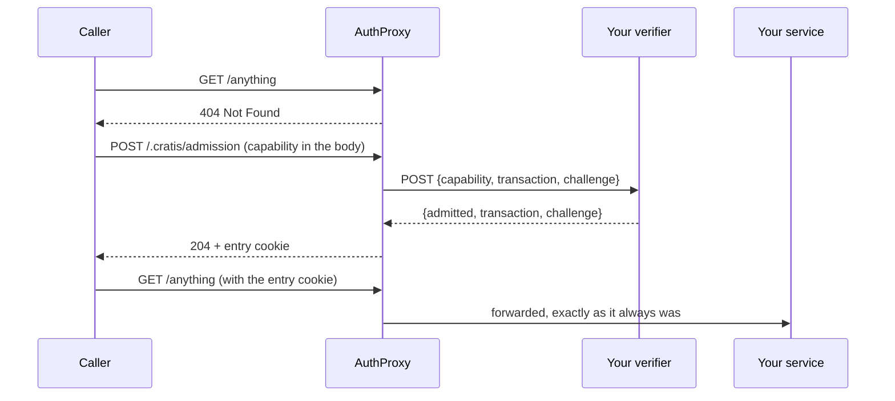

# Admission

AuthProxy's sign-in surface is public by design. The provider list at `/.cratis/providers`, the
per-provider challenge endpoints, the selection page and every asset behind it all answer a caller who has
never signed in — because a person who has never signed in has to reach them in order to sign in at all.

That is right for a deployment whose front door is meant to be found. It is wrong for one whose *existence*
is not meant to be discoverable: the provider list names the identity providers the organization trusts,
the challenge endpoint confirms whether a named provider is configured, and every one of them says an
AuthProxy is here.

**Admission** is the switch between those two deployments. In `CapabilityOnly` mode nothing at all is
answered until a caller presents a capability the deployment's own verifier admits.

---

## The shape of it



Everything downstream of the gate is unchanged. An admitted caller meets exactly the authentication,
authorization, tenancy and routing they would have met with admission switched off — admission decides
whether there is anything here to reach, not who may reach it.

---

## Turning it on

Name a mode and a verifier. Everything else has a default.

```json
{
  "Cratis": {
    "AuthProxy": {
      "Admission": {
        "Mode": "CapabilityOnly",
        "Capability": {
          "VerifierUrl": "https://members.example.com/admit"
        }
      }
    }
  }
}
```

With Aspire:

```csharp
builder.AddAuthProxy("authproxy")
       .WithCapabilityOnlyAdmission("https://members.example.com/admit");
```

**Leaving the section out changes nothing.** The default mode is `Public`, which is what every release
before this behaved as. This is an opt-in posture, not a hardening of the default — turning it on closes a
contract that other deployments depend on being open.

---

## Settings

| Setting | Default | Meaning |
|---------|---------|---------|
| `Mode` | `Public` | `Public` or `CapabilityOnly`. Anything else is refused at startup. |
| `Capability:VerifierUrl` | *(none)* | The absolute `http`/`https` URL that decides whether a presented capability admits. **Required** under `CapabilityOnly`. |
| `Capability:Path` | `/.cratis/admission` | The one path a capability may be presented on. |
| `Capability:MaximumLength` | `4096` | The largest capability, in bytes, AuthProxy will read from a presentation. |
| `EntryLifetime` | `00:20:00` | How long an admitted browser stays admitted. |

There is deliberately **no default verifier URL**. A verifier is your own service, and inventing an address
for it would mean a misconfigured deployment silently calling something else.

---

## The verifier contract

This is the whole of what a deployment has to implement. AuthProxy is deliberately not the authority on
what a capability means — it reads a value, carries it here, and does what it is told, so issuance,
revocation, single use, expiry and every other rule stay entirely on your side of the call.

### The request

`POST` to `VerifierUrl`, `Content-Type: application/json`:

```json
{
  "capability": "the exact value the caller presented, uninterpreted",
  "transaction": "3f9c0a1b7e2d4c6f4a2e8d1c0b7a6934…",
  "challenge": "8b1d5e7a0c3f29417d6b4e2a9c8f0135…"
}
```

`transaction` and `challenge` are two independent 256-bit values AuthProxy mints per presentation and never
reuses. They are opaque to you.

### The reply

`200 OK`, `Content-Type: application/json`:

```json
{
  "admitted": true,
  "transaction": "3f9c0a1b7e2d4c6f4a2e8d1c0b7a6934…",
  "challenge": "8b1d5e7a0c3f29417d6b4e2a9c8f0135…"
}
```

**Echo both values back exactly**, or the answer is refused. A reply that does not name the exact
presentation it belongs to is not an answer to it, and treating it as one would let a reply meant for some
other presentation admit this caller. The comparison is fixed-time.

Any other field you send is read past and ignored. Nothing you return is stored, forwarded or sealed into
the browser — the entry cookie carries the two values AuthProxy authored and an expiry, and nothing else, so
its size is one you cannot influence.

### Every other outcome is a refusal

| What your verifier did | What AuthProxy does |
|---|---|
| `{"admitted": true}` echoing both values | Admits |
| `{"admitted": false}` | Refuses |
| Echoed the wrong transaction or challenge | Refuses |
| Answered a non-`2xx` status | Refuses |
| Answered a body that will not parse | Refuses |
| Answered with a redirect | Refuses — the redirect is **not** followed |
| Could not be reached | Refuses |
| Took longer than **5 seconds** | Refuses |
| Threw anything at all | Refuses |

Failing closed is the point: a verifier outage that let callers in would make the whole mode worth nothing.
The corollary is that **a verifier outage is a full outage** — nobody new is admitted while it lasts, though
browsers already holding a live entry keep working until it expires.

The redirect row is deliberate. `VerifierUrl` is constrained at startup to one absolute `http`/`https` URL,
and following a `3xx` would hand that constraint back to whoever answers it — an anonymous POST would become
an AuthProxy-originated POST to any internally reachable host, carrying the caller's capability in the body.

---

## What the caller does

One `POST`, with the capability as the **raw request body**:

```bash
curl -i -X POST https://app.example.com/.cratis/admission \
     --data-binary 'the-capability-value'
```

```http
HTTP/1.1 204 No Content
Set-Cookie: .cratis-entry=…; max-age=1200; path=/; samesite=lax; httponly; secure
```

The capability is read from the body and **from nowhere else** — not a path segment, not a query parameter,
not a header, not a cookie. Every one of those is a place a value ends up written into an access log, a
proxy's cache key or a browser's history, and a bearer value that admits a caller has no business in any of
them.

The answer carries no body. What the browser needs is the cookie.

### Anything else is the uniform refusal

A `GET` to the presentation path, a body over `MaximumLength`, an empty body, a capability the verifier
refused, a verifier that never answered — all of them produce the identical `404`, the same one an unknown
path produces. The endpoint is not a probe for whether the mode is on.

---

## Entry lifetime

`EntryLifetime` bounds one interactive entry — choosing a provider, completing the round-trip to the
identity provider, and coming back — not a session. The session cookie the sign-in produces has its own,
much longer, lifetime and is unaffected.

The default is **twenty minutes**, and the number is not arbitrary. ASP.NET Core's own
`RemoteAuthenticationOptions.RemoteAuthenticationTimeout` allows **fifteen minutes** at the provider, and
enrolling in MFA, resetting a password or working through a consent screen routinely uses them. An entry
shorter than that expires while the framework still considers the handshake live, and the caller comes back
to a `404` with no way to recover and — by design — nothing in any response or log to diagnose it from.

**Do not set `EntryLifetime` below fifteen minutes.** If you shorten it, shorten
`RemoteAuthenticationTimeout` to match.

When an entry does expire, the caller presents a new capability. That is the recovery path, and it is worth
making sure whoever hands out capabilities can hand out another one.

---

## What a refusal looks like

Every refusal is the same refusal, byte for byte:

```http
HTTP/1.1 404 Not Found
Content-Length: 9
Content-Type: text/plain; charset=utf-8
Cache-Control: no-store

Not Found
```

No `Server` header, no `WWW-Authenticate`, no `Allow`, no `Location`, no `Set-Cookie`, no branded error
page. Response headers queued by anything upstream are cleared rather than added to, so a challenge or a
cookie an earlier decision produced cannot survive into a refusal and make it distinguishable. Every route
and every method answers this — including the paths AuthProxy itself owns, and including a
management-listener path offered to the public listener.

### What it does not hide

The claim is that the **content** of the answers is indistinguishable, not that every observable is.

- **Timing.** A presentation on `Capability:Path` costs a verifier round-trip that no other path costs — on
  loopback, roughly 1.1 ms against 0.5 ms, and up to the full five-second budget when the verifier hangs.
  The presentation path is therefore discoverable by timing.
- **`MaximumLength`.** An over-length body is refused *before* the round-trip starts, so the configured
  bound is discoverable by binary search against that timing difference.

Neither is addressed, and deliberately so: closing them would mean padding every refusal to the slowest one,
which buys an attacker learning where a path is that already answers nothing, at a real cost in
availability. Treat an unguessable `Capability:Path` as one less thing to notice, never as the control.

---

## What an operator should expect to observe

The hardest part of running a closed deployment is that it is designed to say nothing, so know in advance
what the signals are.

| Symptom | What it means |
|---|---|
| Every request answers `404`, including yours | Working as configured. Present a capability. |
| The process refuses to start, naming `Admission:Capability:VerifierUrl` | The mode is on and no verifier is named. This is the one misconfiguration that cannot announce itself later. |
| The process refuses to start, naming `Admission:Mode` | The mode is neither `Public` nor `CapabilityOnly`. A value outside the enum binds silently, so it is refused rather than treated as either. |
| A presentation answers `404` instead of `204` | The verifier refused, was unreachable, timed out, or answered about a different presentation. Which one is in **your log**, at `Warning`. |
| Admission worked, then everything answers `404` again | The entry expired, or the deployment's Data Protection key ring changed. |

AuthProxy's own logs are deliberately parameterless — a capability is a bearer value and the presentation
path names the deployment's closed door, so neither ever reaches a log sink. The four messages are:

- `Debug` — a presented capability was refused by the verifier.
- `Warning` — the verifier could not be reached, or did not answer in time.
- `Warning` — the verifier answered about a different presentation than the one it was asked about.
- `Error` — no verifier is configured, so nothing can be admitted.

The detail you need for a specific presentation is on the verifier's side, where you own it.

### Data Protection

The entry cookie is sealed with the application's ASP.NET Core Data Protection key ring, under a purpose of
its own. A deployment that does not persist its keys issues a new key ring on every restart, which
invalidates every outstanding entry — set
[`DataProtectionKeysPath`](authentication.md) to a persistent volume, and share it across replicas, or every
instance will refuse the entries the others issued.

---

## What this changes elsewhere

### `AnonymousPaths` do not apply

A path a service declares in [`AnonymousPaths`](services.md#anonymous-paths) is still closed to an
unadmitted caller. That is not an oversight — the whole point of the mode is that nothing is answered
before admission, and `AnonymousPaths` is a statement about *authentication*, one layer further in.

For a deployment that needs a genuinely public surface *and* a closed one, run two deployments. See
[Public application surfaces](public-surfaces.md).

### Unauthenticated responses do not apply either

The `401`/`403`/selection-page rules in [Unauthenticated responses](unauthenticated-responses.md) describe
what happens *after* admission. To an unadmitted caller there is only the uniform `404`.

This includes probes. A liveness or readiness probe pointed at any application path gets `404` on a closed
deployment — use the [management listener](management-listener.md), whose port is separate and whose
endpoints are not gated by admission.

### `Invite` cannot be combined with it

`CapabilityOnly` and an `Invite` section together are refused at startup. Two capability mechanisms in one
deployment is a misconfiguration: an invitation is a capability with its own issuance, its own browser state
and its own refusals, and it would be reached only through a door admission has already closed. Refusing the
combination keeps the option of unifying them later open, rather than freezing whichever precedence happened
to ship.

### The token endpoint needs an entry too

`/.cratis/token` is mapped when any service declares client credentials — but on a closed deployment it sits
behind the gate like everything else, so a machine client has to present a capability first and send the
resulting entry cookie with its token request. That is a two-step nobody expects from an OAuth token
endpoint.

If your closed deployment serves machine clients, either give them a capability as part of provisioning, or
front them with a deployment left in `Public` mode. A closed deployment where no service declares client
credentials does not get the endpoint at all.

---

## What is refused at startup

Each of these would otherwise start cleanly and then refuse every caller alive, with a `404` that says
nothing about why:

| Configuration | Why it is refused |
|---------------|-------------------|
| `Mode` outside the enum (including a number) | A name the binder cannot parse already refuses to start; a number binds silently and would leave the gate inert or the deployment closed with nothing checked. |
| `CapabilityOnly` with no `VerifierUrl` | Nothing can ever be admitted. |
| A `VerifierUrl` that is not an absolute `http`/`https` URL | An absolute filesystem path parses as an absolute URI on Unix, so the scheme is named rather than merely parsed. |
| A `Capability:Path` that is not rooted | Matches no request, so nothing can ever be presented. |
| `Capability:MaximumLength` of zero or less | A bound of nothing refuses every capability. |
| `EntryLifetime` of zero or less | An entry that has expired before it is issued admits nobody. |
| `CapabilityOnly` together with `Invite` | Two capability mechanisms in one deployment. |
